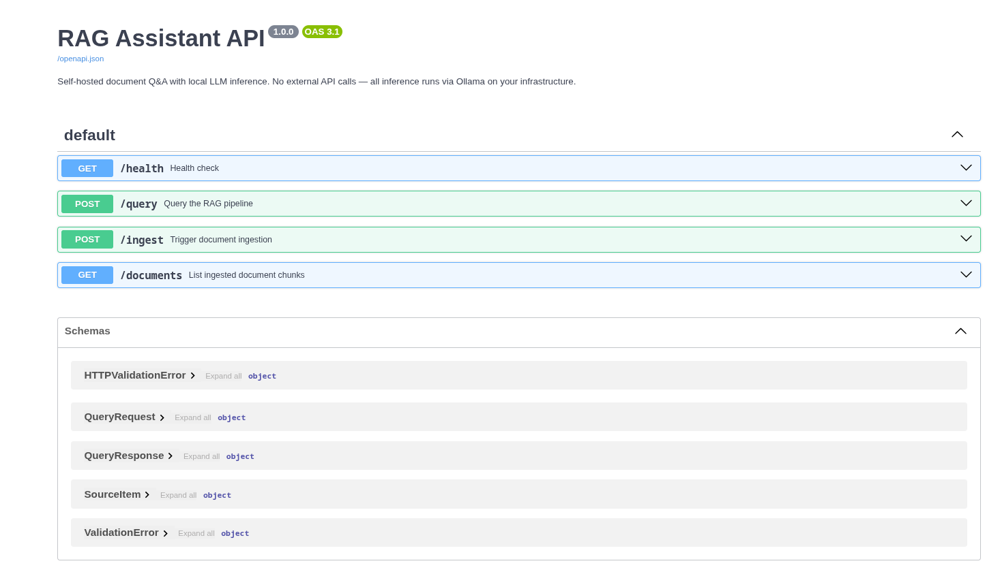
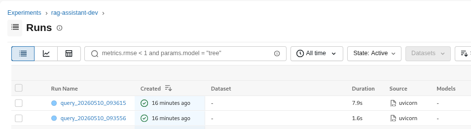
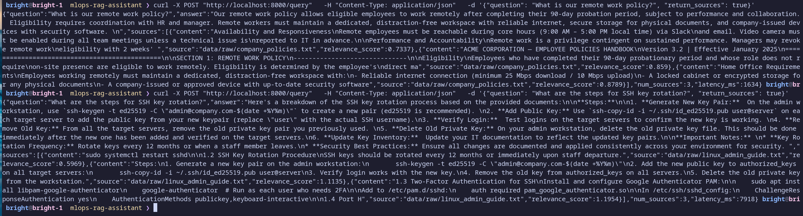

# RAG Assistant — Self-Hosted Enterprise AI

> **I build secure self-hosted AI assistants over company documentation, with local LLM inference, retrieval pipelines, API integration, monitoring, and deployment automation.**

[](https://www.python.org/downloads/)
[](https://fastapi.tiangolo.com)
[](https://docs.docker.com/compose/)
[](https://mlflow.org)
[](LICENSE)

**Self-hosted RAG assistant with local LLM inference, FastAPI, ChromaDB, and MLflow observability.**

Run a private, fully on-premise AI assistant over your company documents — no external API calls, no data leakage, no per-query costs.

---

## Business Use Case

**Private company documentation assistant for internal PDFs, run fully on-premise without external API calls.**

Typical deployments:

| Use Case | Example Documents |
|----------|-------------------|
| HR Policy Q&A | Employee handbook, onboarding guides, leave policies |
| IT Helpdesk Automation | Runbooks, SOPs, troubleshooting guides |
| Security Procedure Assistant | Compliance docs, incident response playbooks |
| Engineering Knowledge Base | Architecture docs, ADRs, API references |

All inference runs locally via Ollama. Your documents never leave your infrastructure.

---

## Screenshots

### API — Swagger UI (`/docs`)


### MLflow — Query Observability Dashboard


### Terminal Demo — Ingestion + Query


---

## Architecture

```
┌──────────────────────────────────────────────────────────────────┐
│                       INGESTION PIPELINE                         │
│                                                                  │
│   PDF / TXT → Text Splitter → SentenceTransformers Embeddings    │
│                                        ↓                         │
│                              ChromaDB Vector Store               │
└──────────────────────────────────────────────────────────────────┘
                                    ↓
┌──────────────────────────────────────────────────────────────────┐
│                        QUERY PIPELINE                            │
│                                                                  │
│   User Query → Embed → Similarity Search → Top-K Chunks          │
│                                        ↓                         │
│                     Context + Query → Ollama (local LLM)         │
│                                        ↓                         │
│                          Grounded Answer + Sources               │
│                                        ↓                         │
│                            MLflow Experiment Log                 │
└──────────────────────────────────────────────────────────────────┘
```

Full system design: [docs/architecture.md](docs/architecture.md)

---

## Tech Stack

| Layer | Technology |
|-------|------------|
| LLM Inference | [Ollama](https://ollama.com) — Phi-3, Llama 3.2, Mistral, Gemma |
| Embeddings | SentenceTransformers (`all-MiniLM-L6-v2`) |
| Vector Database | ChromaDB (persistent, local) |
| Orchestration | LangChain |
| API | FastAPI + Uvicorn |
| Observability | MLflow |
| Deployment | Docker Compose |

---

## Quick Start

### Option A — Docker Compose (Recommended)

```bash
git clone https://github.com/koichog/mlops-rag-assistant.git
cd mlops-rag-assistant

cp .env.example .env

# Start all services: API, Ollama, MLflow
docker compose up -d

# Pull a model into the Ollama container
docker exec -it rag-ollama ollama pull phi3

# Ingest the demo dataset
docker exec -it rag-api python src/data/ingest_documents.py

# Query the API
curl -X POST "http://localhost:8000/query" \
  -H "Content-Type: application/json" \
  -d '{"question": "What is our remote work policy?", "return_sources": true}'
```

| Service | URL |
|---------|-----|
| REST API | http://localhost:8000 |
| Swagger UI | http://localhost:8000/docs |
| MLflow UI | http://localhost:5000 |
| Ollama | http://localhost:11434 |

---

### Option B — Local Development

**Prerequisites:** Python 3.10+, [Ollama](https://ollama.com/download)

```bash
git clone https://github.com/koichog/mlops-rag-assistant.git
cd mlops-rag-assistant

python -m venv venv && source venv/bin/activate

pip install -r requirements.txt
pip install -e .

# Pull an Ollama model
ollama pull phi3

cp .env.example .env

# Ingest demo documents
python src/data/ingest_documents.py

# Start API
uvicorn src.api.main:app --reload

# View experiment logs
mlflow ui
```

---

## Demo Dataset

`data/raw/` includes a realistic corporate knowledge base ready to ingest:

| File | Content |
|------|---------|
| `company_policies.txt` | Remote work, leave, expense, and code of conduct policies |
| `linux_admin_guide.txt` | SSH hardening, user management, monitoring, and maintenance runbooks |
| `mlops_notes.txt` | MLOps lifecycle, pipeline patterns, model serving, and drift detection |
| `security_procedures.txt` | Incident response, access control, vulnerability management, and compliance |

```bash
# Ingest all demo documents
python src/data/ingest_documents.py

# Try some example queries
curl -X POST "http://localhost:8000/query" \
  -H "Content-Type: application/json" \
  -d '{"question": "How many remote work days are employees allowed per week?"}'

curl -X POST "http://localhost:8000/query" \
  -H "Content-Type: application/json" \
  -d '{"question": "What are the steps for SSH key rotation?"}'

curl -X POST "http://localhost:8000/query" \
  -H "Content-Type: application/json" \
  -d '{"question": "How should we respond to a data breach?"}'
```

---

## API Reference

### `POST /query`

```json
{
  "question": "What is our remote work policy?",
  "return_sources": true
}
```

**Response:**
```json
{
  "question": "What is our remote work policy?",
  "answer": "Employees may work remotely up to 3 days per week with manager approval...",
  "sources": [
    {
      "content": "Remote Work Policy: Employees are permitted to work remotely...",
      "source": "data/raw/company_policies.txt",
      "relevance_score": 0.91
    }
  ],
  "num_sources": 3,
  "latency_ms": 1340
}
```

### `GET /health`

```json
{
  "status": "ok",
  "ollama": "connected",
  "chromadb": "connected"
}
```

### `POST /ingest`

Trigger document ingestion from `data/raw/`. Returns chunk count on completion.

### `GET /documents`

```json
{
  "total_chunks": 247
}
```

Full interactive docs: **http://localhost:8000/docs**

---

## MLflow Observability

Every query is automatically logged:

| Artifact | Description |
|----------|-------------|
| `question` param | The user query |
| `num_retrieved_docs` metric | Chunks used to build context |
| `latency_ms` metric | End-to-end query time |
| `answer.txt` | Full LLM response |
| `context.txt` | Retrieved document context |

```bash
mlflow ui  # → http://localhost:5000
```

Compare query runs, inspect retrieved context, track latency over time.

---

## Project Structure

```
mlops-rag-assistant/
├── data/
│   ├── raw/                    # Source documents (PDF, TXT)
│   ├── processed/              # Intermediate artifacts
│   └── vector_store/           # ChromaDB persistence
├── src/
│   ├── api/
│   │   └── main.py             # FastAPI application
│   ├── data/
│   │   └── ingest_documents.py # Ingestion pipeline
│   ├── models/
│   │   └── llm_ollama.py       # Ollama LLM wrapper
│   └── rag/
│       ├── retriever.py        # Vector retrieval
│       └── pipeline.py         # RAG orchestration + MLflow
├── docs/
│   ├── architecture.md         # System design document
│   └── screenshots/            # UI captures
├── configs/
│   └── config.yaml             # All configuration
├── docker-compose.yml          # Production deployment
├── Dockerfile                  # API container
├── Dockerfile.mlflow           # MLflow server container
├── .env.example                # Environment template
├── requirements.txt
└── test_rag.py                 # End-to-end test script
```

---

## Configuration

**`configs/config.yaml`**
```yaml
rag:
  chunk_size: 500       # Characters per document chunk
  chunk_overlap: 50     # Overlap between consecutive chunks
  top_k: 3             # Chunks retrieved per query

embeddings:
  model_name: "sentence-transformers/all-MiniLM-L6-v2"

mlflow:
  experiment_name: "rag-assistant-dev"
  tracking_uri: "./mlruns"
```

**`.env`** (from `.env.example`)
```bash
OLLAMA_HOST=http://localhost:11434
OLLAMA_MODEL=phi3
```

Switch models by changing `OLLAMA_MODEL` — no code changes required.

---

## Enterprise Roadmap

Features planned for production enterprise deployments:

- [ ] **Authentication** — API key and OAuth2/JWT middleware
- [ ] **RBAC** — Role-based access control per document collection
- [ ] **Audit Logs** — Tamper-proof query and access logs to PostgreSQL
- [ ] **Prometheus + Grafana** — Real-time latency, throughput, and error dashboards
- [ ] **PostgreSQL / pgvector** — Enterprise-scale vector storage alternative to ChromaDB
- [ ] **S3 / MinIO Backups** — Automated vector store and model artifact backup
- [ ] **Kubernetes Deployment** — Helm chart with autoscaling and multi-replica support
- [ ] **Streaming Responses** — Server-Sent Events for real-time answer streaming
- [ ] **Hybrid Search** — BM25 + semantic fusion for higher retrieval precision
- [ ] **Multi-Collection RBAC** — Isolated document collections per team or department
- [ ] **CI/CD Pipeline** — GitHub Actions for automated testing and container builds

---

## Testing

```bash
# End-to-end RAG pipeline test
python test_rag.py

# API health check
curl http://localhost:8000/health

# Unit tests
pytest tests/
```

---

## Author

**Koichi Guevara** — [GitHub](https://github.com/koichog)

> I build secure self-hosted AI assistants over company documentation, with local LLM inference, retrieval pipelines, API integration, monitoring, and deployment automation.

---

## License

MIT
